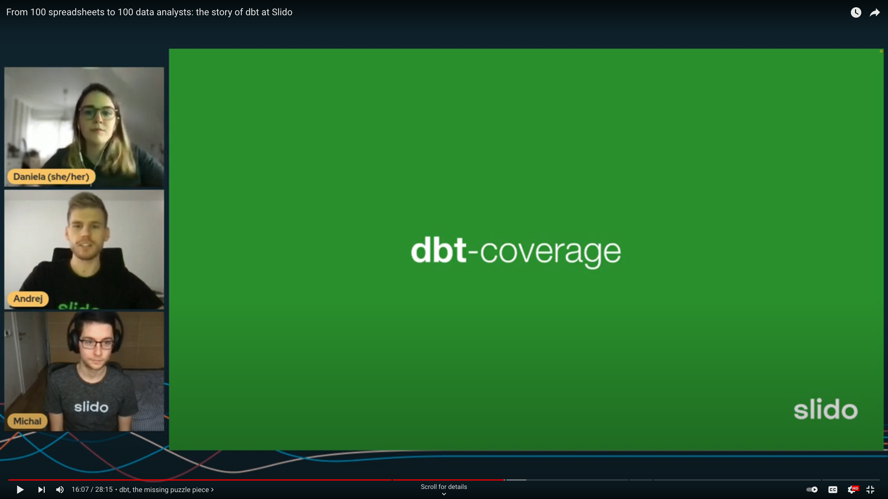

# dbt-coverage

<a href="https://pypi.org/project/dbt-coverage/"></a>
<a href="https://pepy.tech/project/dbt-coverage"></a>


<a href="https://github.com/slidoapp/dbt-coverage/blob/main/LICENSE.md"></a>
[](https://app.fossa.com/projects/git%2Bgithub.com%2Fslidoapp%2Fdbt-coverage?ref=badge_shield)


_One-stop-shop for docs and test coverage of [`dbt`](https://github.com/dbt-labs/dbt) projects._

## Why do I need something like this?

_**[`dbt-coverage`](https://github.com/slidoapp/dbt-coverage) is to [`dbt`](https://github.com/dbt-labs/dbt) what [`coverage.py`](https://github.com/nedbat/coveragepy) and [`interrogate`](https://interrogate.readthedocs.io/en/latest/) are to Python.**_

It is a single CLI tool which checks your `dbt` project for missing documentation and tests.

Keeping documentation and tests close to the actual SQL code that generates the final model is one of the best design choices of `dbt`. It ensures documentation is actually useful and tests are actually used. But how do you make adding those a habit in your [`dbt`](https://github.com/dbt-labs/dbt) project?

That is exactly where `dbt-coverage` comes in. It will

- Give you a better sense of the level of documentation and test coverage in your project;
- Help your CI/CD pipeline make sure new changes include documentation and tests;
- Let you quickly assess the documentation and tests of a new `dbt` project you get your hands on.

Still not convinced? Here are some more features:

- ✨ **zero-config**: just install it and run it, there is nothing to set up
- 🏁 **minimal dependences**: the only dependencies are [`click`](https://click.palletsprojects.com/en/8.0.x/) (already installed with [`dbt`](https://github.com/dbt-labs/dbt)) and [`typer`](https://typer.tiangolo.com/tutorial/)
- 📦 **very small**: at ~480 [SLOC](https://en.wikipedia.org/wiki/Source_lines_of_code), you can easily validate it works as advertised


## Demo
The package was presented during [Coalesce](https://coalesce.getdbt.com/),
the annual dbt conference, as a part of the talk
[_From 100 spreadsheets to 100 data analysts: the story of dbt at Slido_](https://www.getdbt.com/coalesce-2021/from-spreadsheets-to-data-analysts-the-story-of-dbt-at-slido/).
Watch a demo in the video below.

[](https://youtu.be/YA0yqYSs9BQ?t=936)

## Installation

```
pip install dbt-coverage
```

## Usage

`dbt-coverage` comes with two basic commands: `compute` and `compare`. The
documentation for the individual commands can be shown by using the `--help`
option.

### Compute

Compute coverage from `target/catalog.json` and `target/manifest.json` files
found in a dbt project, e.g.
[jaffle_shop](https://github.com/dbt-labs/jaffle_shop). 

To choose between documentation and test coverage, pass `doc` or `test` as the CLI argument.

```console
$ cd jaffle_shop
$ dbt run  # Materialize models
$ dbt docs generate  # Generate catalog.json and manifest.json
$ dbt-coverage compute doc --cov-report coverage-doc.json  # Compute doc coverage, print it and write it to coverage-doc.json file

Coverage report
=====================================================================
jaffle_shop.customers                                  6/7      85.7%
jaffle_shop.orders                                     9/9     100.0%
jaffle_shop.raw_customers                              0/3       0.0%
jaffle_shop.raw_orders                                 0/4       0.0%
jaffle_shop.raw_payments                               0/4       0.0%
jaffle_shop.stg_customers                              0/3       0.0%
jaffle_shop.stg_orders                                 0/4       0.0%
jaffle_shop.stg_payments                               0/4       0.0%
=====================================================================
Total                                                 15/38     39.5%

$ dbt-coverage compute test --cov-report coverage-test.json  # Compute test coverage, print it and write it to coverage-test.json file

Coverage report
=====================================================================
jaffle_shop.customers                                  1/7      14.3%
jaffle_shop.orders                                     8/9      88.9%
jaffle_shop.raw_customers                              0/3       0.0%
jaffle_shop.raw_orders                                 0/4       0.0%
jaffle_shop.raw_payments                               0/4       0.0%
jaffle_shop.stg_customers                              1/3      33.3%
jaffle_shop.stg_orders                                 2/4      50.0%
jaffle_shop.stg_payments                               2/4      50.0%
=====================================================================
Total                                                 14/38     36.8%
```

### Compare

Compare two `coverage.json` files generated by the `compute` command. This is
useful to ensure that the coverage does not drop while making changes to the
project.

```console
$ dbt-coverage compare coverage-after.json coverage-before.json

# Coverage delta summary
              before     after            +/-
=============================================
Coverage      39.47%    38.46%         -1.01%
=============================================
Tables             8         8          +0/+0
Columns           38        39          +1/+0
=============================================
Hits              15        15          +0/+0
Misses            23        24          +1/+0
=============================================

# New misses
=========================================================================
Catalog                         15/38   (39.47%)  ->    15/39   (38.46%) 
=========================================================================
- jaffle_shop.customers          6/7    (85.71%)  ->     6/8    (75.00%) 
-- new_col                       -/-       (-)    ->     0/1     (0.00%) 
=========================================================================
```

### Combined use-case

```console
$ cd my-dbt-project

$ dbt run  # Materialize models
$ dbt docs generate  # Generate catalog.json and manifest.json
$ dbt-coverage compute doc --cov-report before.json --cov-fail-under 0.5  # Fail if coverage is lower than 50%

# Make changes to the dbt project, e.g. add some columns to the DWH, document some columns, etc.

$ dbt run  # Materialize the changed models
$ dbt docs generate  # Generate catalog.json and manifest.json
$ dbt-coverage compute doc --cov-report after.json --cov-fail-compare before.json  # Fail if the current coverage is lower than coverage in before.json
$ dbt-coverage compare after.json before.json  # Generate a detailed coverage delta report
```

## Related packages

- https://github.com/mikaelene/dbt-test-coverage
- [interrogate](https://interrogate.readthedocs.io/en/latest/) (docs coverage for Python)
- [coverage.py](https://github.com/nedbat/coveragepy) (execution coverage for Python)

## License

Licensed under the MIT license (see [LICENSE.md](LICENSE.md) file for more
details).

[](https://app.fossa.com/projects/git%2Bgithub.com%2Fslidoapp%2Fdbt-coverage?ref=badge_large)
